# Lab 2: Deploy Agent Tools

## Introduction

This lab configures the OCI Generative AI Agent tools. You will confirm the RAG tool created in Lab 1, configure an Autonomous AI Database and Database Tools connection for SQL, add a Weather tool, and test the multi-tool agent.

The following agent tools will be configured: 
* General LLM Chat (Built-in)
* Weather
* RAG 
* SQL

Estimated Time: 45 minutes

### Objectives

In this lab, you will:
* Deploy VCN and subnet for ADB
* Create Vault to store DB secret
* Define agent tools in the OCI console
* Provision an Oracle Autonomous AI Database
* Create DB Tools Connection

### Prerequisites

This lab assumes you have:

* An Oracle account
* All previous labs successfully completed

> **Important:** Before enabling SQL execution or SQL self-correction, ensure that the Generative AI Agent runtime has permission to use the Database Tools connection and read its password secret. See [SQL Tool Guidelines for Generative AI Agents](https://docs.oracle.com/en-us/iaas/Content/generative-ai-agents/sqltool-guidelines.htm).

For the compartment that contains the Database Tools connection and secret, the agent runtime requires policies equivalent to:

```text
<copy>
Allow any-user to use database-tools-connections in compartment <compartment-name> where request.principal.type='genaiagent'
Allow any-user to read database-tools-family in compartment <compartment-name> where request.principal.type='genaiagent'
Allow any-user to read secret-family in compartment <compartment-name> where request.principal.type='genaiagent'
</copy>
```

## Task 1: Add Agent Routing Instructions and Confirm RAG Tool Configuration

1. Navigate to your GenAI Agent created in the previous lab 

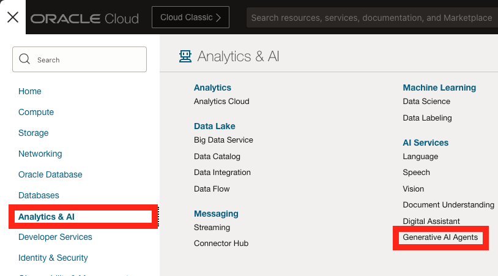

2. Edit your agent and add the following routing instructions: 

    ```text
     <copy>
      You are a helpful assistant. If user asks about <info on your dataset>, use the rag tool. If user asks about employees, use atomlivelab-sql tool. If user asks about the weather, use the weather tool. If user asks a general question, use your general knowledge, no tools.
     </copy>
    ```

    > **Note** Be sure to replace "info on your dataset" above with a relevant term to your knowledge base to help the agent route to the correct tool. In our example, our dataset relates to wines.

3. Select your agent and confirm it has a RAG tool as configured in the previous lab. If not, create a new tool.

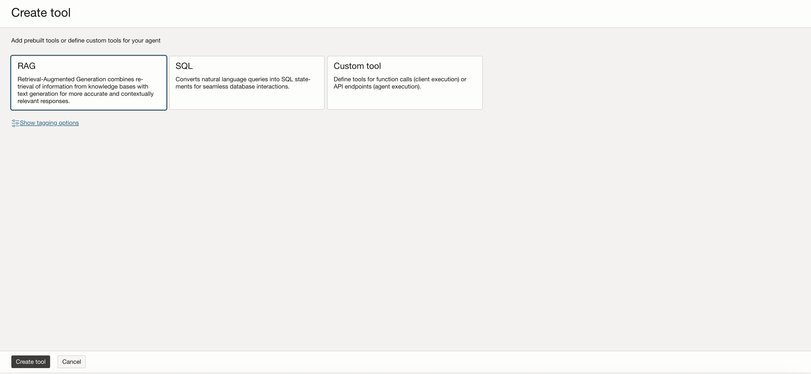

4. Confirm the description of the tool and the knowledge base you created in the previous lab 

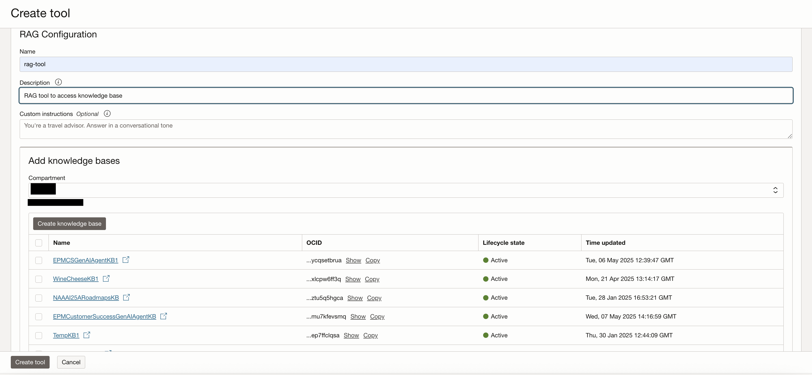

5. Navigate to the agent endpoint and launch the chat. You should now be able to ask questions about your dataset - 

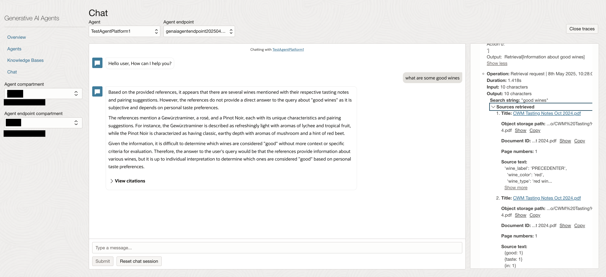

## Task 2: Create VCN and Private Subnet

This task will help you to create a VCN and private subnet in your compartment. This will be used for the ADB for the SQL Tool.

1. Go to Networking -> Virtual cloud networks and select the VCN created in Lab 1.

2. Click on the private subnet and go to the Security List. Add following ingress rules in the security list. Make sure to have the ingress rule to access database port 1521-1522

    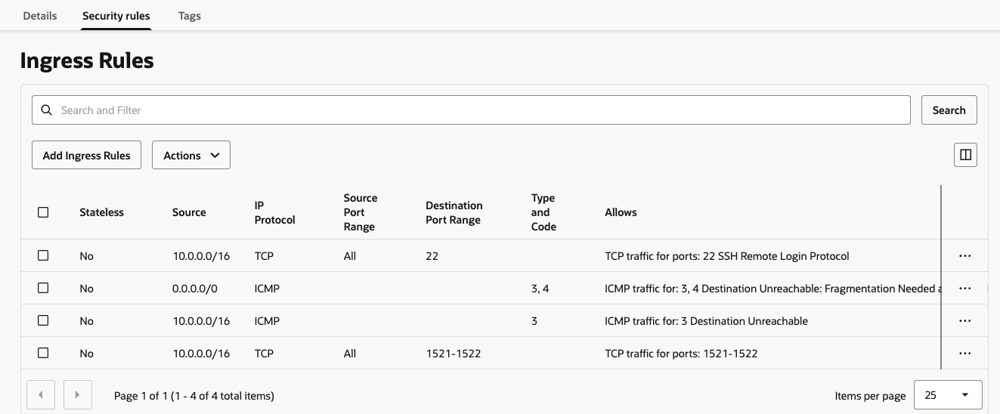

## Task 3: Create Vault to store database secrets

This task will help you to create vault which would be used to save secrets for the database. The secrets are used for the agent to connect to your database with the db tool connection.

1. Locate Vault under Key Management & Secret Management. Provide Name and click on Create Vault.

    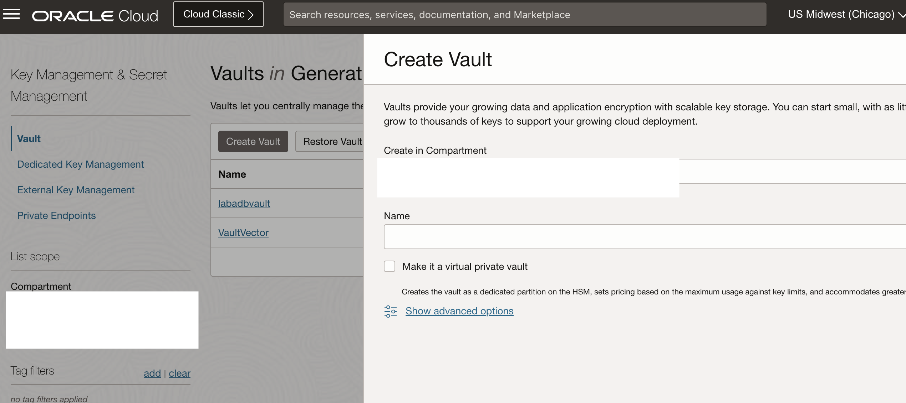

2. Go to the newly created Vault. Click on Create Key.

3. Provide Name and leave rest as default. Choose Protection Mode as HSM and click on Create Key.

    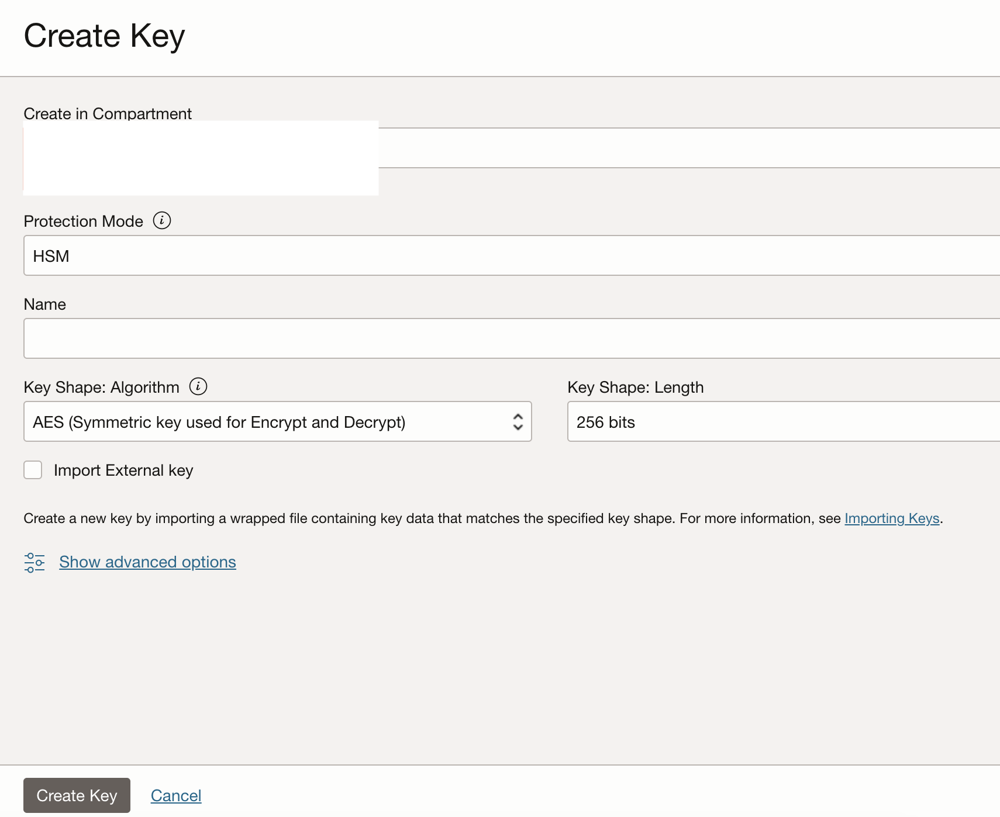

## Task 4: Create Autonomous Database

This task involves creating Autonomous Database 23ai.

1. Locate Autonomous Databases under Oracle Databases. Click on Create Autonomous Database.

    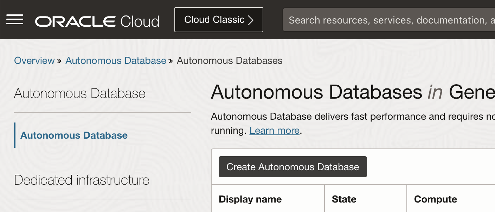

2. Provide information for Compartment, Display name, Database name. Choose workload type as Transaction Processing. Choose deployment type as Serverless. Choose database version as 23ai and give it a password of your preference. 

    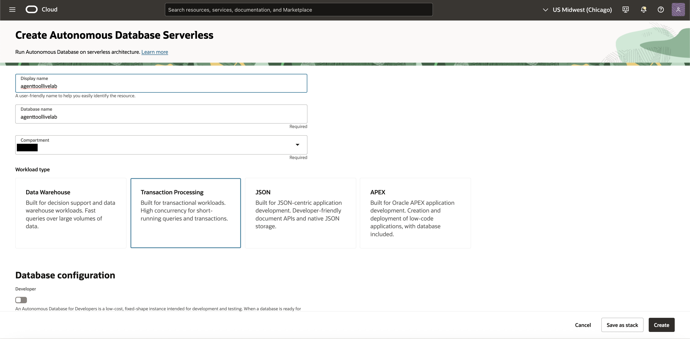

3. Make sure to select the Network Access: Private Endpoint access only, and select the VCN and subnet mentioned in above section. Also, do not check Require mutual TLS (mTLS) authentication.

    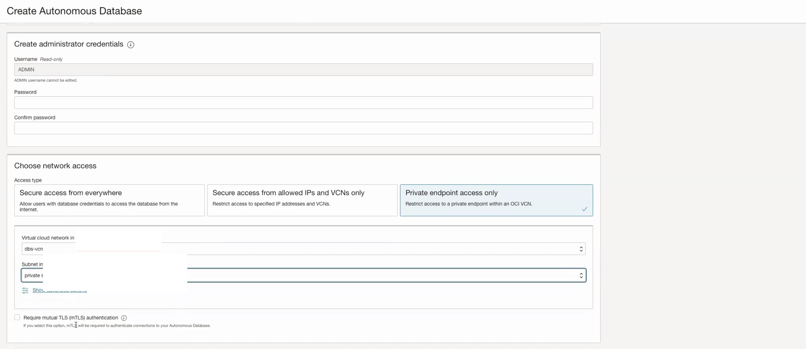

4. Finally click on Create Autonomous Database.

## Task 5: Create Database Tools Connection

This task involves creating a Database Tools Connection which will be used to query the database using SQL Worksheet.

1. Locate Database Tools Connections under Developer Services. Click on Create connection.

    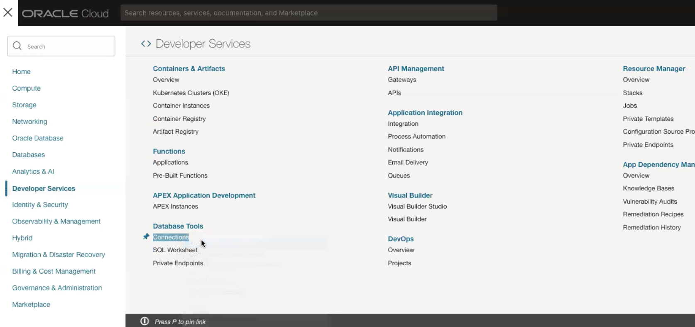

2. Provide Name and Compartment information. Choose Oracle Autonomous Database as Database cloud service. Provide Username as admin.

3. Click on Create password secret. Provide Name, Vault and Key created in Task 3. Provide same password used at the time of ADB creation in previous task.

    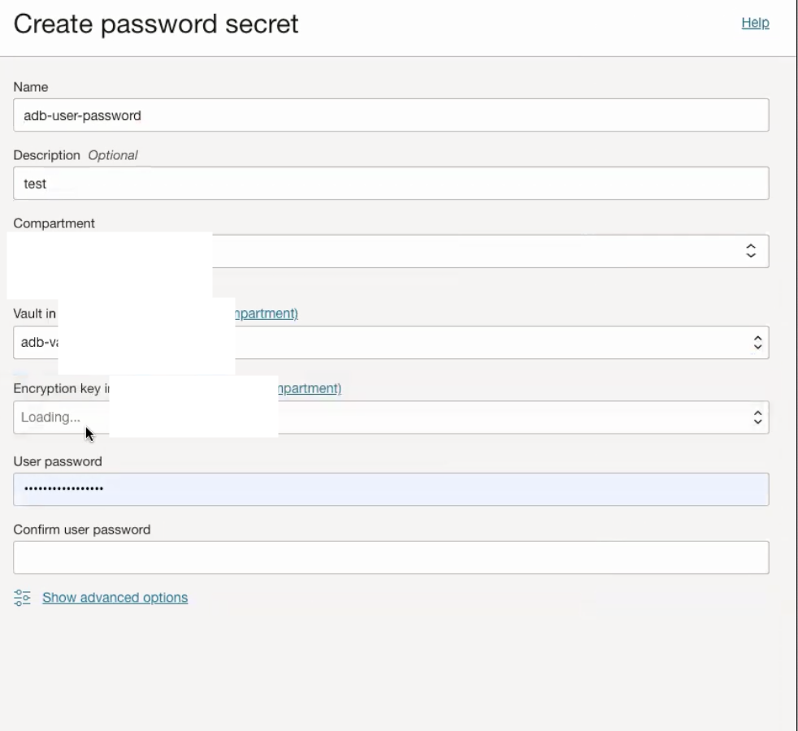

4. Use the newly created password secret as User password secret.

5. Copy the connection string from your autonomous database. Go to ADB and click on database connection and copy any of the low, medium or high connection strings as shown below,

    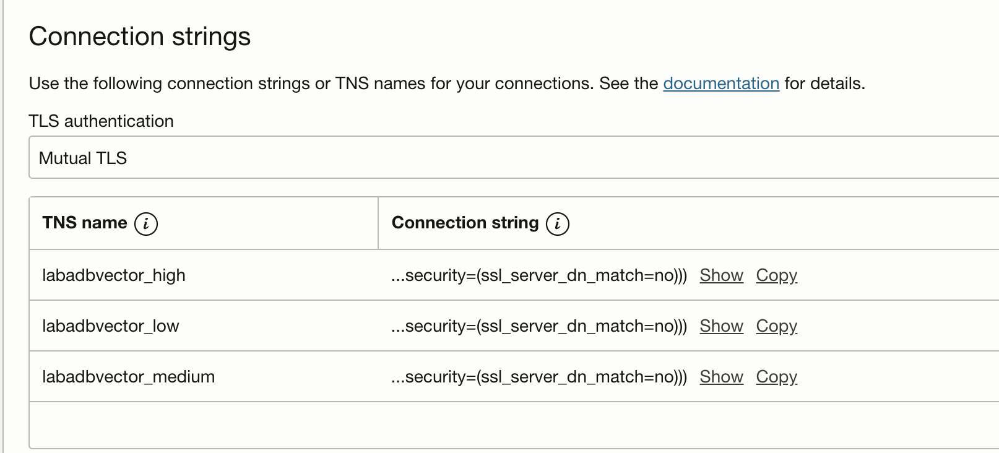

6. Modify the connection string with the following: Reduce retry_count form 20 to 3; Replace host with private ip address. You can get Private IP address from the autonomous database as shown below.

    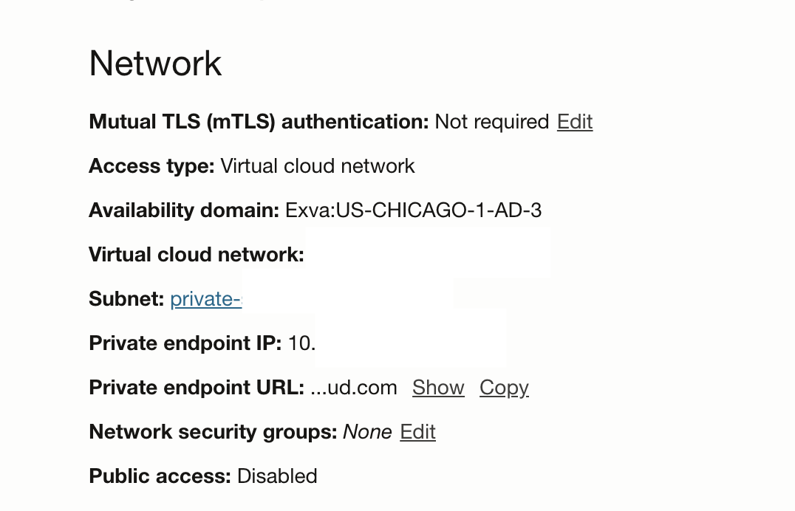

7. Click on Create private endpoint. Provide Name and private subnet created in Task 1.

    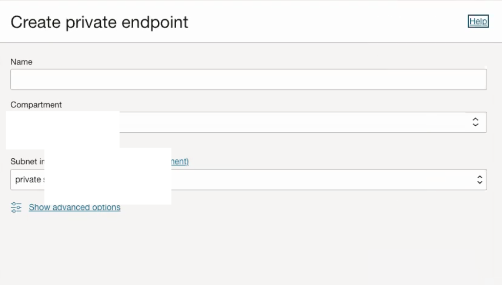

8. Choose newly created private endpoint as Private Endpoint.

9. Choose Wallet format as None in SSL details.

10. Click on Create to create a database tools connection.

    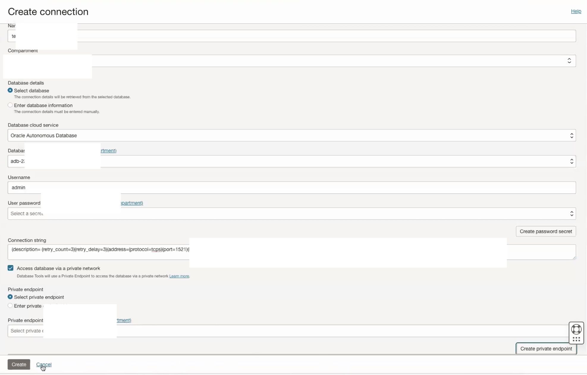

11. Go to newly create Database Tools connection. Click on Validate.

    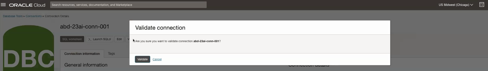

## Task 6: Create and Populate Employee Table

1. Navigate to the SQL Worksheet of your newly created ADB and run the following statements: 

> **Note** You can create or use your own tables here; we provided the table below for illustration purposes. 

```text
<copy>
CREATE TABLE Employees (
    EmployeeID INT PRIMARY KEY,
    Name VARCHAR(100) NOT NULL,
    DepartmentID INT,
    HireDate DATE NOT NULL
);
</copy>
```

- Populate your table with the following data 

```text
<copy>
INSERT ALL
INTO Employees (EmployeeID, Name, DepartmentID, HireDate) VALUES (1, 'John Doe', 1, TO_DATE('2020-01-01', 'YYYY-MM-DD'))
INTO Employees (EmployeeID, Name, DepartmentID, HireDate) VALUES (2, 'Jane Smith', 2, TO_DATE('2020-02-01', 'YYYY-MM-DD'))
INTO Employees (EmployeeID, Name, DepartmentID, HireDate) VALUES (3, 'Bob Johnson', 1, TO_DATE('2020-03-01', 'YYYY-MM-DD'))
INTO Employees (EmployeeID, Name, DepartmentID, HireDate) VALUES (4, 'Alice Brown', 3, TO_DATE('2020-04-01', 'YYYY-MM-DD'))
INTO Employees (EmployeeID, Name, DepartmentID, HireDate) VALUES (5, 'Mike Davis', 2, TO_DATE('2020-05-01', 'YYYY-MM-DD'))
SELECT * FROM dual;
</copy>
```

  > **Note** If you use your own table, large queries can cause timeouts in the agent service & ODA. Try filtering your results to avoid timeouts.

## Task 7: Create SQL Tool
1. In the console navigate to your agent and create a new SQL Tool

  

2. Enter name e.g. atomlivelab-sql and description, along with the database schema 

> **Note** Make sure to use the same schema defined from the previous task.

```text
<copy>
CREATE TABLE Employees (
    EmployeeID INT PRIMARY KEY,
    Name VARCHAR(100) NOT NULL,
    DepartmentID INT,
    HireDate DATE NOT NULL
);
</copy>
```

> **Note** If using your own table, to get a better idea of the schema run

```sql
DESC table_name;
```
 
in SQL Developer. 

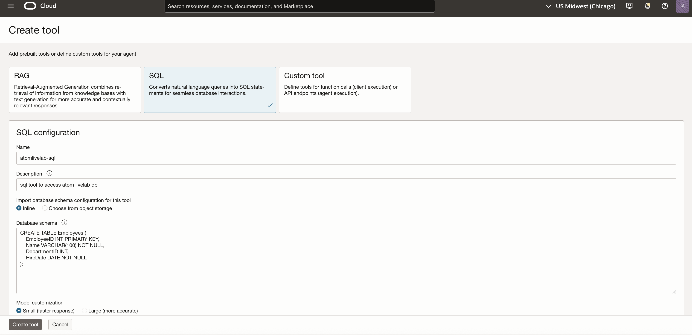

3. Select Oracle SQL as the dialect and select the database tool connection configured in the previous task. Enable SQL Execution and self correction. 
4. Test the connection 

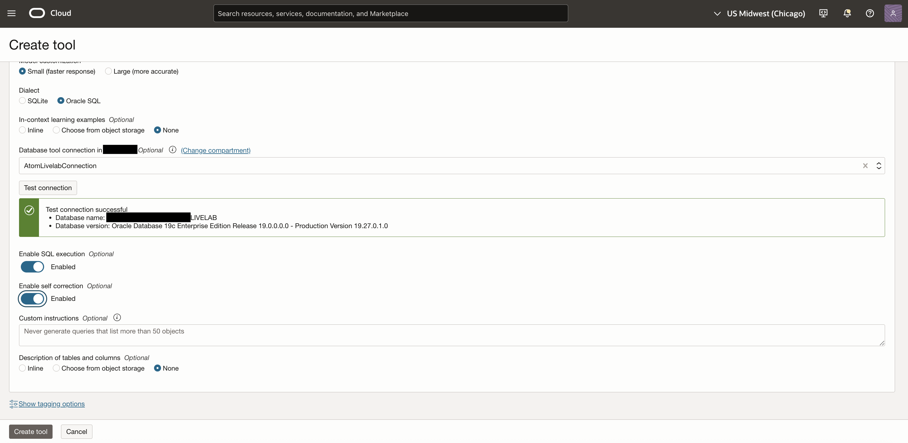

5. Create the tool 

6. Navigate to your endpoint and launch the chat. Ask a question such as "Give me list of employees". The agent should invoke the SQL Tool and convert the query to Oracle SQL, then return the result - 

  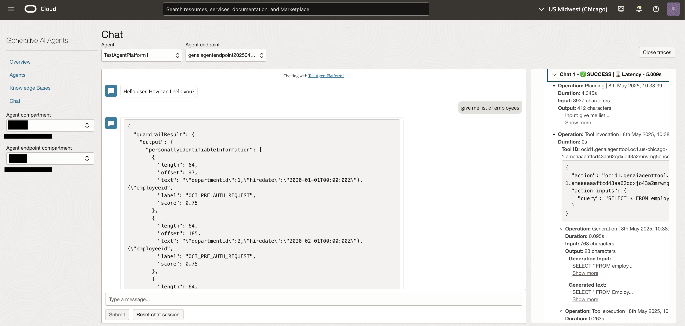

  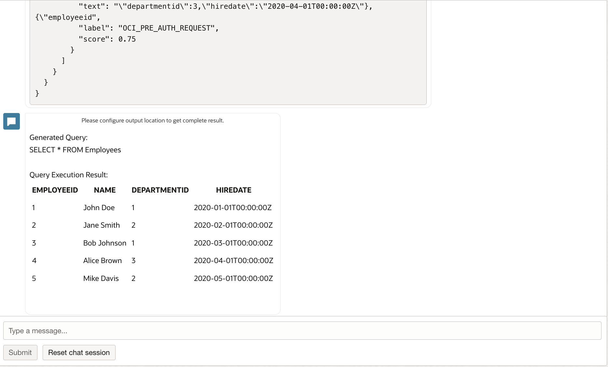

  > * **Note** If the sql tool is not returning the correct response, it can be helpful to provide an in-line example to the tool. Also see [SQL Tool Guidelines](https://docs.oracle.com/en-us/iaas/Content/generative-ai-agents/sqltool-guidelines.htm#sqltool-iclexamples)

  > * **Note** Also make sure the agent is using the correct tool for the job. If the agent is using the wrong tool, make sure to add a more detailed description and/or routing instructions.

## Task 8: Create a Weather Tool

  1. Navigate to the agent tools and create a new custom function tool called "get_weather" 

  - Give the following description - 

    ```text
    <copy>
      Get the weather for a given location
    </copy>
    ```

  - Paste the following function parameters - 
    ```text
    <copy>
    {"type":"object","properties":{"location":{"type":"string"}},"required":"['location']"}
    </copy>
    ```

  2. Create the tool 


## Task 10: Chat with your Agent

- You should now have all tools configured. Ask questions and your agent should determine which tools to use based on your query.

## Learn More

* [SQL Tool Guidelines for Generative AI Agents](https://docs.oracle.com/en-us/iaas/Content/generative-ai-agents/sqltool-guidelines.htm)
* [ADB Shared with Private Endpoint Access](https://docs.oracle.com/en-us/iaas/database-tools/doc/oracle-database-use-cases.html#OCDBT-GUID-C2C8BC15-EDB1-47D6-BDFC-852558C8D650)
* [Database Tools - ADB Shared with Public IP](https://docs.oracle.com/en-us/iaas/database-tools/doc/oracle-database-use-cases.html#OCDBT-GUID-87796740-BAE4-4805-BF6D-C75A02A3D1D4)
* [RAG Tool Oracle Database Guidelines for Generative AI Agents](https://docs.oracle.com/en-us/iaas/Content/generative-ai-agents/oracle-db-guidelines.htm)

## Acknowledgements

**Author** 
  * **Luke Farley**, Senior Cloud Engineer, NACIE

**Contributors**
  * **Kaushik Kundu**, Master Principal Cloud Architect, NACIE
  * **Abhinav Jain**, Senior Cloud Engineer, NACIE
  * **Ale Casas**, Senior Principal Product Marketing
  * **Raj Arora**, Master Principal Analytics Cloud Architect

**Last Updated By/Date**
* **Luke Farley**, Senior Cloud Engineer, NACIE, August 2026
