# Lab 1: Provision and Configure GenAI Agent

## Introduction

This lab will walk through the steps of deploying and configuring a Generative AI Agent with an associated knowledge base.

Estimated Time: 45 minutes

### Objectives

In this lab, you will:
* Make sure that your tenancy is subscribed to the Chicago region.
* Provision GenAI Agent
* Configure RAG Tool for Agent in console UI

### Prerequisites

This lab assumes you have:

* Access to the Chicago region
* For a self-managed tenancy, the required IAM permissions listed in **Deploying in Your Own Tenancy?** in the workshop introduction.

> **Luna Lab participants:** Required policies are preconfigured. If you are using your own tenancy, see **Deploying in Your Own Tenancy?** in the workshop introduction.

## Task 1: Ensure Chicago Region is Accessible

If your tenancy is already subscribed to the Chicago region, please skip to the next task.

1. On the top right, click the Regions drop down menu.

  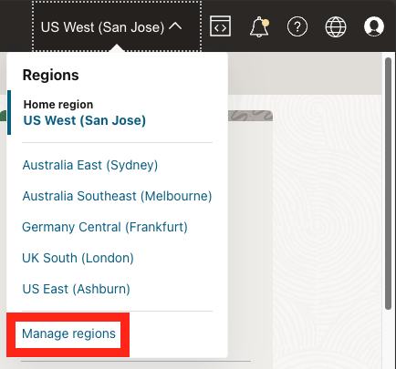

1. Review the list of regions your tenancy is subscribed in. If you find the **US Midwest (Chicago)** region in the list, switch to it and proceed to the next task.

    If Chicago isn't listed, ask your tenancy administrator to subscribe to the region before continuing.

## Task 2: Provision Oracle Object Storage Bucket

This task will help you to create Oracle Object Storage Bucket under your chosen compartment. This will be used for the RAG tool.

1. Locate Buckets under Object Storage & Archive Storage

    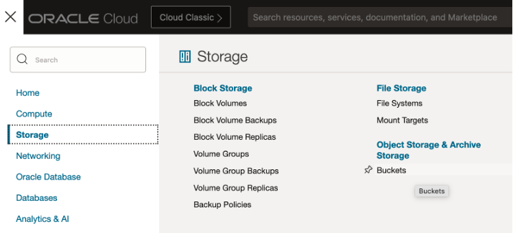

2. Provide the information for **Compartment** and **Bucket Name**. Click Create.
    The Object Storage Bucket will be created. Keep the visibility of bucket as Private.

    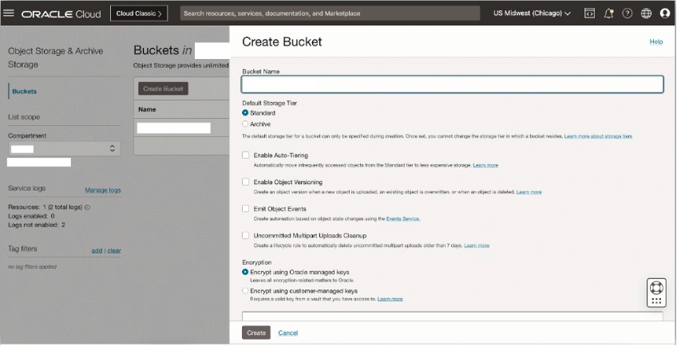

## Task 3: Upload PDF Document(s) to the Object Storage Bucket

1. Click on the Bucket name, then Objects -> Upload button

    Click on “select files” link to select files from your machine. This step can be repeated to select multiple files to upload to the bucket.

    **Note:** For this workshop, upload a PDF or text document that you are permitted to use as a RAG source.

    You can use the sample PDF, [Design Considerations for GenAI Apps](https://objectstorage.us-chicago-1.oraclecloud.com/p/D5X4v88ZpEJ82ui8OrlrRQDkuLU0775OpiXl8tYOALLw6v9imMssIc0KovdN_qKB/n/idb6enfdcxbl/b/Livelabs/o/atom-multi-tool-livelab/Design%20Considerations%20for%20GenAI%20Apps.pdf). If that link is unavailable, upload a PDF or text document you are authorized to use instead.

    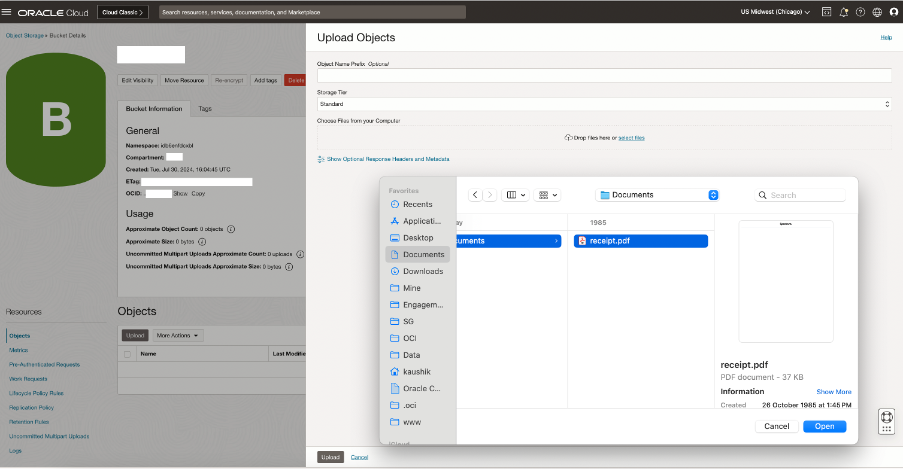

2. Click Upload -> Close to upload the PDF file in the Object Storage Bucket.

    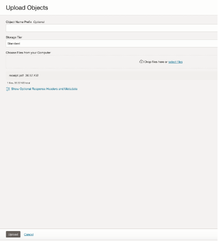

## Task 4: Provision Knowledge Base

This task will help you to create Oracle Generative AI Agent’s Knowledge Base under your chosen compartment.

1. Locate Generative AI Agents under AI Services

    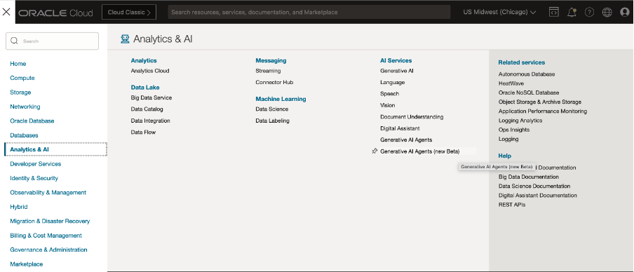

2. Locate Knowledge Bases in the left panel, select the correct Compartment.

    Then click on “Create knowledge base” button

    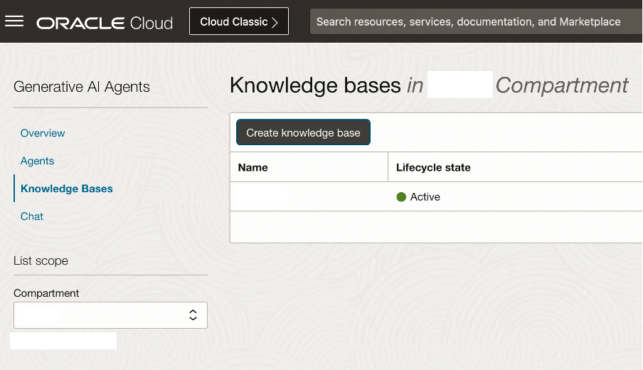

3. Specify the name of the knowledge base, ensure that you have selected the correct compartment.

    Select “Object storage” in the “Select data source” dropdown, and then click on the “Specify data source” button

    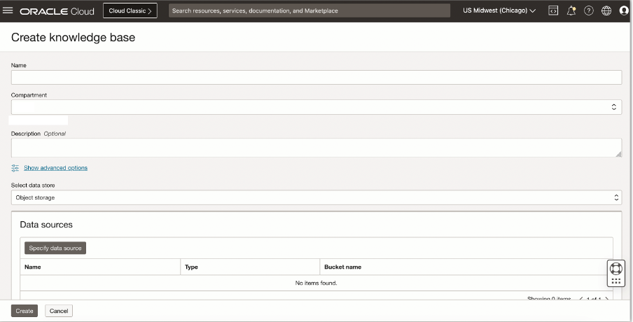

4. Specify the name of the data source and Description (Optional)

    Select the bucket that you have created in the previous lab, and for Object prefix choose “Select all in bucket”

    Click the “Create” button

    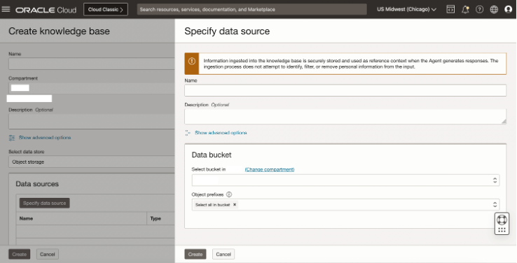

5. Click the “Create” button to create the knowledge base

    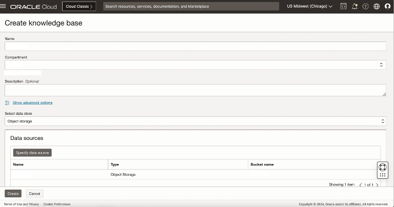

6. In few minutes the status of recently created Knowledge Base will change from Creating to Active.

    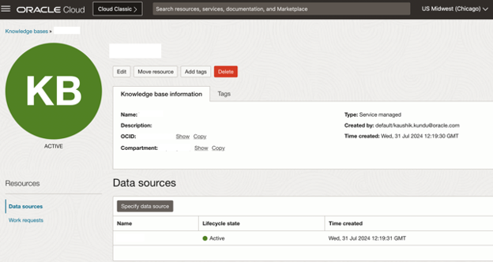

7. Open the data source and start or review its ingestion job. Processing can take up to 30 minutes. Wait until ingestion completes successfully and the uploaded document is listed as ingested before creating or testing the RAG tool. If ingestion fails, Luna Lab participants should contact the facilitator; self-managed participants should review the policy reference in the workshop introduction.

## Task 5: Provision GenAI Agent

This task will help you to create Oracle Generative AI Agent under your chosen compartment.

1. Locate Agents in the left panel, select the correct Compartment.

    Then click on “Create agent” button

    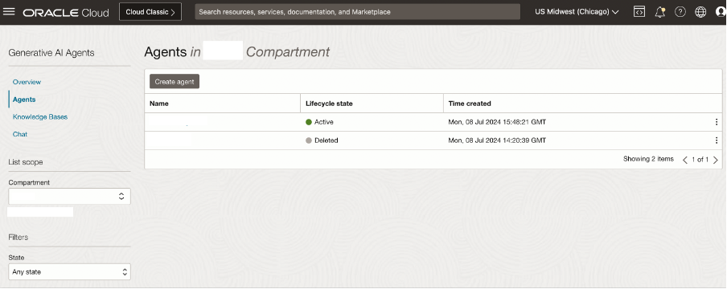

2. Specify the agent name, ensure the correct compartment is selected and indicate a suitable welcome message

    Select Add tool > Choose RAG tool

    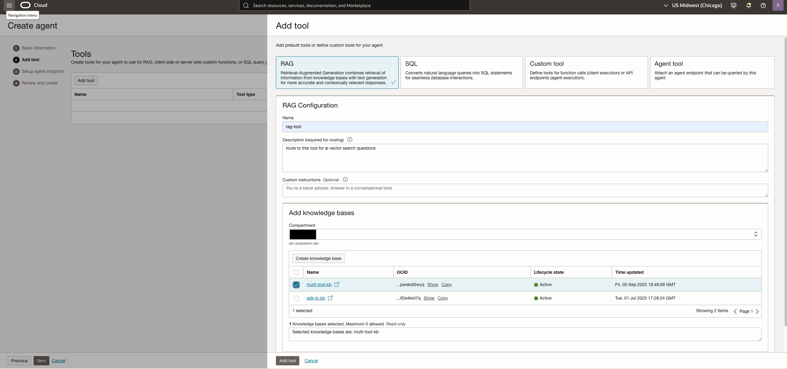

    Select the Knowledge Base that you created in the previous task. Providing the Welcome message is optional.

    Click the “Create” button.

    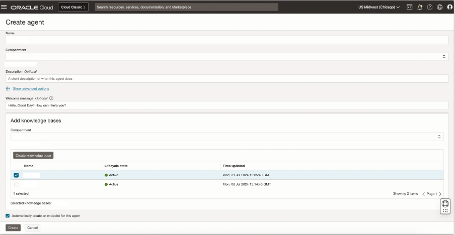

    > **Note** The other agent tools will be configured in the next lab.

3. In few minutes the status of recently created Agent will change from Creating to Active

    Click on “Endpoints” menu item in the left panel and then the Endpoint link in the right panel.

    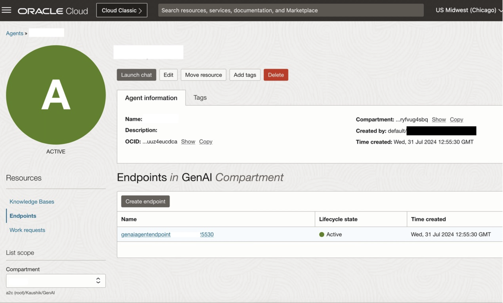

4. It’ll open up the Endpoint Screen. Click on “Launch chat” button.

   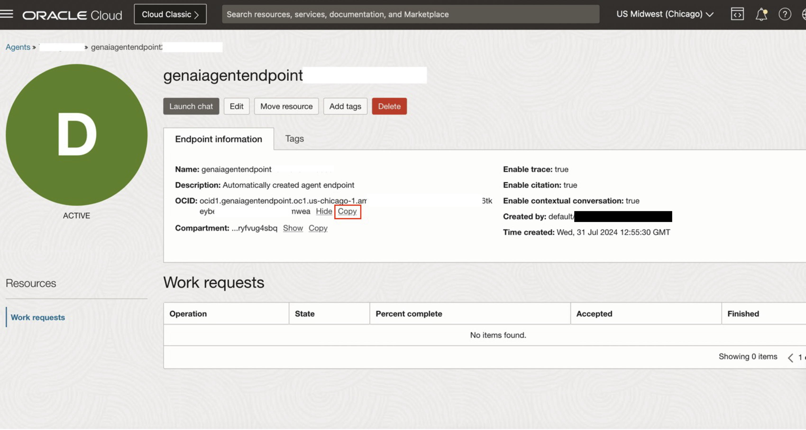

5. It’ll open up the Chat Playground, where you can ask questions in natural language, and get the responses from your PDF documents

    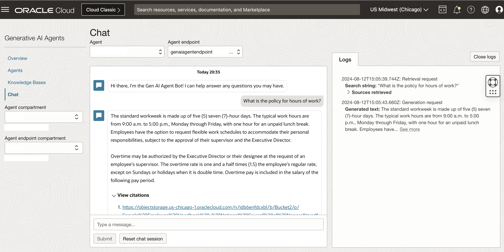

6. You may now **proceed to the next lab**

## Learn More

* [Region subscription](https://docs.oracle.com/en-us/iaas/Content/Identity/Tasks/managingregions.htm#ariaid-title7)
* [Managing Dynamic Groups](https://docs.oracle.com/en-us/iaas/Content/Identity/Tasks/managingdynamicgroups.htm)

## Acknowledgements

**Authors**
* **Luke Farley**, Senior Cloud Engineer, NACIE

**Contributors**
* **Kaushik Kundu**, Master Principal Cloud Architect, NACIE
* **JB Anderson**, Senior Cloud Engineer, NACIE
* **Abhinav Jain**, Senior Cloud Engineer, NACIE
* **Lyudmil Pelov**, Lyudmil Pelov, Senior Principal Product Manager
* **Yanir Shahak**, Senior Principal Software Engineer
* **Ale Casas**, Senior Principal Product Marketing
* **Raj Arora**, Master Principal Analytics Cloud Architect

**Last Updated By/Date:**
* **Luke Farley**, Senior Cloud Engineer, NACIE, August 2026
