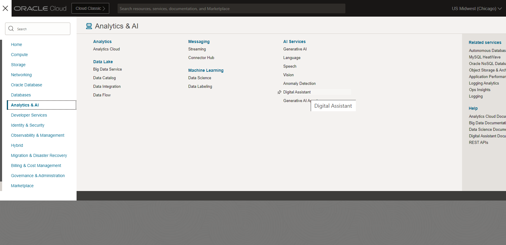
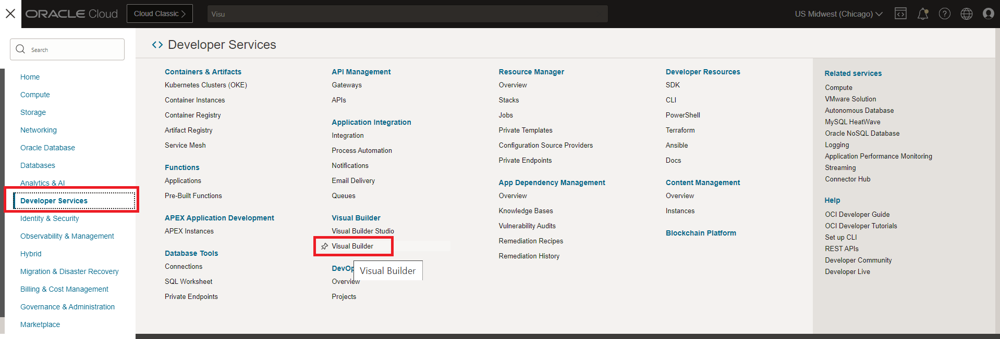
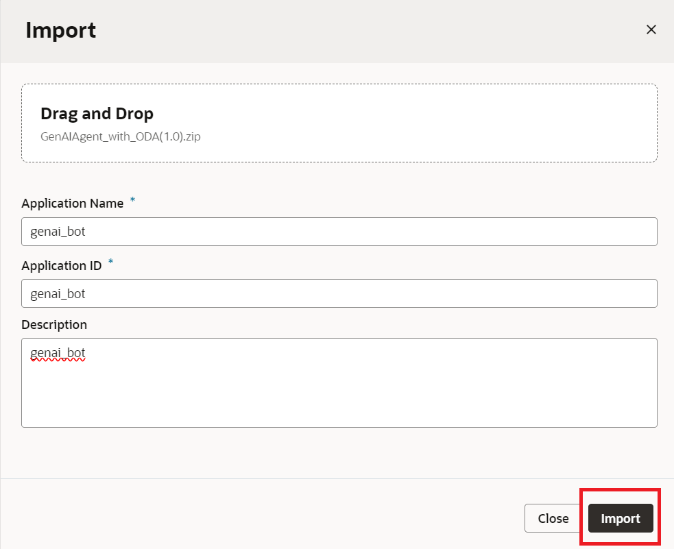
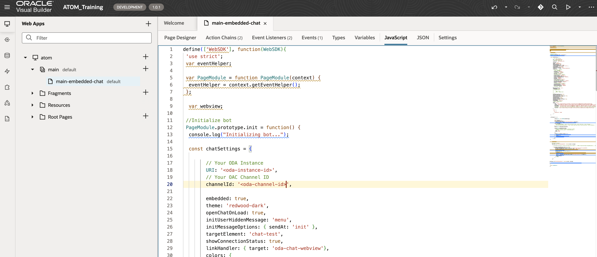

## Lab 3: Provision and Configure Digital Assistant 

## Introduction

This lab will take you through the steps needed to provision and configure Oracle Digital Assistant & Visual Builder Cloud Service. It will also cover dynamic group and policy creation along with the integration with OCI Functions. 

Estimated Time: 2 hours 30 minutes

### About Oracle Digital Assistant

Oracle Digital Assistant delivers a complete AI platform to create conversational experiences for business applications through text, chat, and voice interfaces

## Task 1: Provision Oracle Digital Assistant

This task will help you to create Oracle Digital Assistant under your choosen compartment.

1. Locate Digital Assistant under AI Services

   

   > **Note:** You can find Digital Assistant under the AI Services.

2. Provide the information for **Compartment**, **Name** , **Description** (optional) & **Shape**. Click **Create**

    

3. In few minutes the status of recently created Digital Assistant will change from **Provisioning** to **Active**

    

## Task 2: Dynamic Group & Policy creation for Oracle Digital Assistant

This task will help you to create desired dynamic group & necessary policy for the Oracle Digital Assistant

Create a Dynamic Group
Go to Identity>>Domains>>Default domain>>Dynamic groups


Click on Create dynamic group and name it as odaDynamicGroup

Select radio button - Match any rules defined below
Add the following rules. Please change the values of OCIDs to your own values here.

Rule 1

```text
     <copy>
    All {instance.id = 'ocid1.odainstance.oc1.us-chicago-1.XXXX'}
     </copy>
```

Rule 2

```text
     <copy>
    All {resource.type='odainstance', resource.compartment.id='ocid1.compartment.oc1..XXXX' }
    </copy>
 ```

Rule 3

```text
    <copy>
    ALL {resource.type = 'fnfunc', resource.compartment.id = 'ocid1.compartment.oc1..XXXX'}
     </copy>
```

1. Attach the policy at the root compartment level. Please change the values of OCIDs to your own values here.

    ```text
    <copy>
    Allow any-user to use fn-invocation in tenancy where request.principal.id='ocid1.odainstance.oc1.us-chicago-1.XXXXXXXXXXXXXXXXXXXX'
    Allow dynamic-group odaDynamicGroup to use fn-invocation in tenancy
    </copy>
    ```

    > **Note:**
    > * Please make sure that the compartmentId should be the one under which the resource is  created.

## Task 3: Configure API Endpoint to Agent Function

## Task 4: Import Skill

## Task 5: Configure & Expose Skill

## Task 6: Create VBCS Instance & embed ODA skill in VBCS Application (Please directly move to Step 5 incase you already have a VBCS instance provisioned)

1. Click on main hamburger menu on OCI cloud console and navigate Developer Services > Visual Builder

    

2. Create Visual Builder Instance by providing the details and click **Create Visual Builder Instance**:
    * **Name** = <name_of_your_choice>
    * **Compartment** = <same_compartment_as_oda>
    * **Node** = <as_per_need>

    

3. Wait for the instance to come to **Active** (green color) status

4. Click on the link to download the VB application (zip file): [ATOM_Training.zip](https://objectstorage.us-chicago-1.oraclecloud.com/n/idb6enfdcxbl/b/Excel-Chicago/o/Livelabs%2Fdoc-understanding%2FATOM_Training-1.0.1.zip)

5. Import the application in provisioned instance as per the screenshots. Users only need one VCBS instance created. They can import/create multiple applications in the instance for each additional chatbot they have

    * Click on Import from Visual Builder Instance

        

    * Choose the option as below

        

    * Provide the App Name with other details and select the provided application zip file

        

6. Once import is completed, open the embedded-chat javascript file in the VB Instance and update the details as follows:

    * **URI** = '<https://oda-XXXXXXXXXXXXXXXXXXXXXX.data.digitalassistant.oci.oraclecloud.com/>'
    * **channelId** = 'XXXXXXXXXXXXXXXXXXXXXXXXXXXX'
    * Please change value of initUserHiddenMessage on Line 32 from 'what can you do' to 'Hello'

    

    > **Note**
    > * URI is the hostname of ODA instance provisioned in **Task 1**
    > * channelId is created during **Task 5** - **Step 3**

7. The UI of the chatbot such as theme, color and icon can be changed by modifying the parameters under var chatWidgetSetting from embedded-chat javscript file.

8. Click on the Play button shown in the above image on the top right corner to launch ATOM chatbot and start chatting with ATOM.

9. If the preview is working as expected, you can open your visual builder application and begin conversing with ATOM 

    

**Troubleshooting** 

1. If you get 404 errors, it's likely a permission issue. Please review the policies. 

## Acknowledgements

**Authors**
* **Luke Farley**, Senior Cloud Engineer, NACIE

**Contributors**

**Last Updated By/Date:**
* **Luke Farley**, Senior Cloud Engineer, NACIE, May 2025