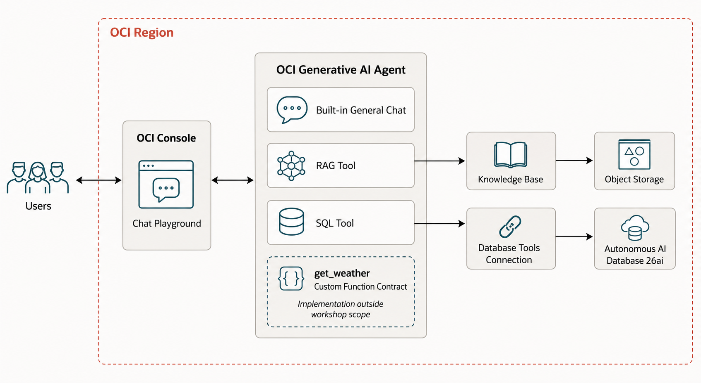

# Introduction

## About this Workshop

In this 90-minute hands-on workshop, you build an OCI Generative AI Agent that selects the right tool for a question. The agent uses a knowledge base for retrieval-augmented generation (RAG), an Oracle AI Database SQL tool for employee questions, a custom Weather tool, and its built-in general chat capability.

The workshop focuses on the backend agent and its tools, with direct testing through the OCI Console Chat Playground. No custom application code is required.



Estimated Time: 90 minutes

### Objectives

By the end of this workshop, you will be able to:

* Create an Object Storage bucket and Knowledge Base for a RAG tool.
* Provision an OCI Generative AI Agent and attach the RAG tool.
* Create and populate an employee database, then connect it to a SQL tool.
* Add a custom Weather tool and agent routing instructions.
* Test that the agent selects the appropriate tool for RAG, SQL, Weather, and general-chat questions.

### Prerequisites

* An OCI tenancy with access to the US Midwest (Chicago) region.
* The IAM permissions listed in **Preparing Your Tenancy** below.

## Preparing Your Tenancy

Before beginning the workshop, ask a tenancy administrator to configure the following access. Replace the placeholders with your group and workshop compartment. Scope policies more narrowly when your tenancy standards require it.

1. Give the workshop user group permission to create and manage the workshop resources:

    ```text
    <copy>
    allow group <workshop-user-group> to manage genai-agent-family in compartment <workshop-compartment>
    allow group <workshop-user-group> to manage object-family in compartment <workshop-compartment>
    allow group <workshop-user-group> to manage autonomous-database-family in compartment <workshop-compartment>
    allow group <workshop-user-group> to manage vaults in compartment <workshop-compartment>
    allow group <workshop-user-group> to manage keys in compartment <workshop-compartment>
    allow group <workshop-user-group> to manage secret-family in compartment <workshop-compartment>
    allow group <workshop-user-group> to manage database-tools-family in compartment <workshop-compartment>
    </copy>
    ```

    This workshop uses a public Autonomous Database endpoint, so it doesn't require `virtual-network-family` permissions. If you change the workshop to use private networking, add the required networking permissions and setup.

2. Allow the agent runtime to execute and self-correct SQL queries through the Database Tools connection:

    ```text
    <copy>
    allow any-user to use database-tools-connections in compartment <workshop-compartment> where request.principal.type='genaiagent'
    allow any-user to read database-tools-family in compartment <workshop-compartment> where request.principal.type='genaiagent'
    allow any-user to read secret-family in compartment <workshop-compartment> where request.principal.type='genaiagent'
    </copy>
    ```

3. For larger or long-running Object Storage ingestion jobs, or when ingestion fails because the job can't read the bucket, an administrator can also configure an ingestion-job dynamic group:

    ```text
    <copy>
    Dynamic group matching rule:
    ALL {resource.type='genaiagentdataingestionjob'}

    IAM policy:
    allow dynamic-group <data-ingestion-dynamic-group> to read objects in compartment <bucket-compartment>
    </copy>
    ```

    The small, unfiltered sample PDF used in this workshop doesn't require this optional configuration when normal ingestion succeeds.

## Workshop Structure

* **Lab 1: Provision and Configure GenAI Agent** (45 minutes) — create the RAG source, Knowledge Base, and agent.
* **Lab 2: Deploy Agent Tools** (45 minutes) — configure routing, SQL, and Weather tools, then test the multi-tool agent.

## Learn More

* [Overview of Generative AI Agent Service](https://docs.oracle.com/en-us/iaas/Content/generative-ai-agents/overview.htm)
* [SQL Tool Guidelines for Generative AI Agents](https://docs.oracle.com/en-us/iaas/Content/generative-ai-agents/sqltool-guidelines.htm)

## Acknowledgements

**Author**

* **Luke Farley**, Senior Cloud Engineer, NACIE

**Contributors**

* **Kaushik Kundu**, Master Principal Cloud Architect, NACIE
* **Abhinav Jain**, Senior Cloud Engineer, NACIE

**Last Updated By/Date:** Luke Farley, August 2026
