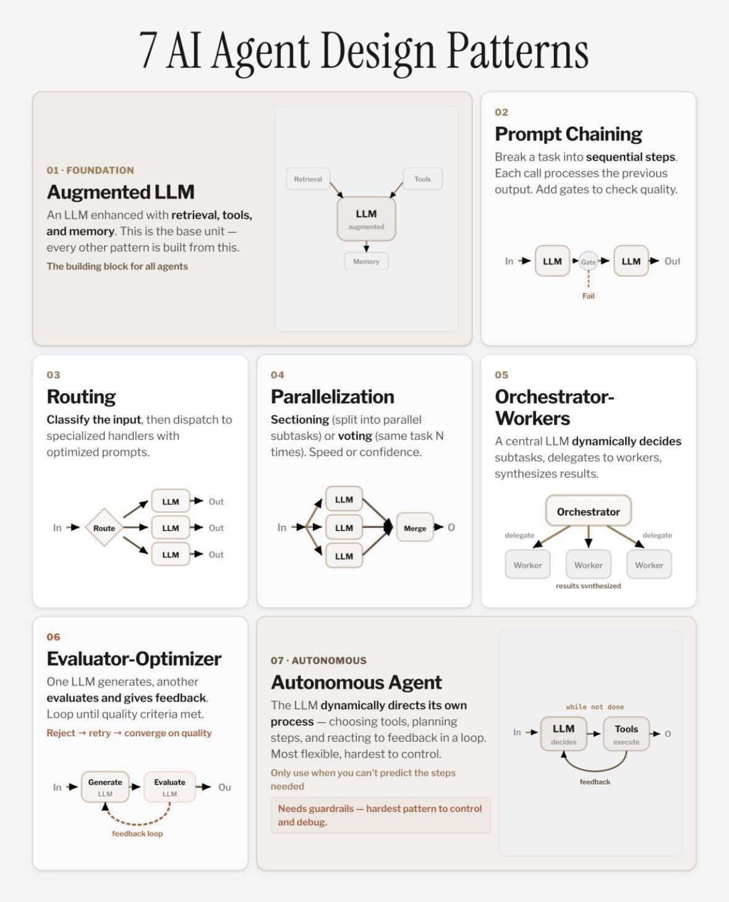

# Project Inception: Enterprise AI Fabric Companion LiveLab

## About this workshop

Project Inception is an agentic landing zone for Oracle Cloud Infrastructure (OCI). It provides reusable building blocks for enterprise AI applications: a shared runtime library, agentic patterns, Model Context Protocol (MCP) servers, solution accelerators, reference recipes, and deployment automation.

This is a **companion LiveLab**. It explains the architecture and guides the decisions needed to implement Project Inception for a customer. It does not publish or distribute the underlying source code.

> **Request implementation access:** The Enterprise AI Fabric implementation is distributed separately by Oracle. To discuss access and the appropriate customer delivery process, contact [anup.ojah@oracle.com](mailto:anup.ojah@oracle.com).

Estimated Workshop Time: 2 hours 15 minutes

### Objectives

In this workshop, you will:

* Explain the layers and reusable assets in the Enterprise AI Fabric.
* Define a customer-specific foundation, tool boundary, recipe, and deployment scope.
* Use Smart Dispatch to understand an end-to-end multi-agent implementation.
* Design security, governance, observability, evaluation, and production-readiness controls.
* Prepare the information Oracle needs to provide the separately distributed implementation.

### Intended audience

This workshop is for solution architects, AI engineers, application developers, security architects, database teams, and customer delivery leads who are evaluating or planning an enterprise agentic solution on OCI.

### What the companion LiveLab includes

The workshop contains customer-safe implementation guidance:

* Architecture and component responsibilities.
* Prerequisite and configuration inventories.
* Selection guidance for agent patterns, MCP servers, and reference recipes.
* Identity, security, observability, evaluation, and deployment checklists.
* Validation outcomes and handoff criteria.

The separately distributed implementation package contains source code, environment templates, tests, deployment assets, and component-specific runbooks. Access to this LiveLab does not grant access to, or a license for, that package.

## Project Inception architecture

The Fabric is organized into five interoperable layers:

| Layer | Responsibility |
|---|---|
| Application and API | React interfaces, API consumers, FastAPI services, Node.js gateways, and command-line entry points |
| Agent orchestration | LangGraph workflows, routing, deep-agent patterns, human approval, and memory-aware execution |
| LLM and MCP tools | Pluggable model providers and explicitly registered tools for Oracle data and OCI services |
| Data, memory, and policy | Oracle Autonomous Database, checkpointing, shared memory, guardrails, IAM/OIDC, and database policy |
| Deployment and operations | Containers, Terraform, networking, secrets, logging, tracing, evaluation, and release validation |

A typical governed request follows this sequence:

1. A user signs in through an approved identity flow.
2. The application passes the user request and identity context to the agent workflow.
3. Input guardrails and audit tracing start before model execution.
4. The workflow selects an approved agent and, when needed, an explicitly registered MCP tool.
5. The MCP boundary validates the bearer token and accesses the permitted Oracle data or OCI service.
6. Database and application policies constrain the returned data and allowed actions.
7. Output guardrails run, the trace closes, and conversation state is checkpointed.
8. The application returns a governed response or pauses for human approval.

## Reusable agent patterns

Project Inception provides reusable patterns so that a customer solution can choose the least autonomous design that satisfies the business requirement.

Start with deterministic workflows and add model-directed routing only where it creates measurable value. Human approval should guard consequential actions such as dispatching work, releasing payments, or changing a system of record.

## Workshop result

At the end of the workshop, you will have a companion implementation brief containing:

* Selected use case and reference recipe.
* Required OCI services and customer-owned dependencies.
* Identity, data, tool, memory, and governance decisions.
* Environment and secret inventory.
* Deployment sequence and validation evidence plan.
* Requested Fabric package version and Oracle point of contact.

## Acknowledgements

* **Authors** - [Anup Ojah](https://github.com/aojah1) and [Luke Farley](https://github.com/lmfarley10), Oracle
* **Contributors**
    * [adrianjalba](https://github.com/adrianjalba)
    * [Andre Correa](https://github.com/andrecorreaneto)
    * [Anup Ojah](https://github.com/aojah1)
    * [Chandrak1907](https://github.com/Chandrak1907)
    * [dawsonmaverick](https://github.com/dawsonmaverick)
    * [Gilson Melo](https://github.com/gilsonmelo)
    * [Greg Keys](https://github.com/gregkeysquest)
    * [JB Anderson](https://github.com/JBAnderson5)
    * [Johannes Murmann](https://github.com/jomurmann)
    * [Kiran Thakkar](https://github.com/kiranthakkar)
    * [mantis](https://github.com/mantis-place)
    * [Noah Paul](https://github.com/npaul64)
    * [Oscar T.](https://github.com/OT16)
    * [praveenkothari](https://github.com/praveenkothari)
    * [rajesharora99](https://github.com/rajesharora99)
    * [Richard Piantini Cid](https://github.com/richardpiantini)
    * [Sania Bolla](https://github.com/sania-bolla)
* **Last Updated By/Date** - Project Inception Team, August 2026
