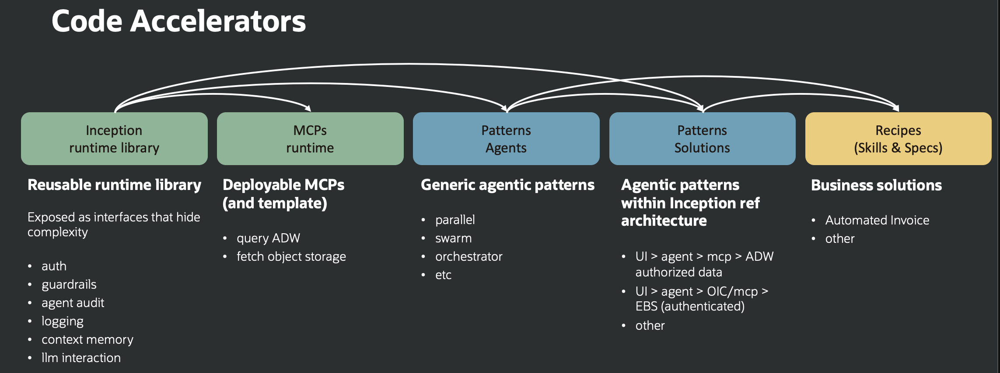

# Design the Fabric Foundation

## Introduction

In this lab, you will map Project Inception's reusable components to the customer use case. The goal is a deliberate foundation: each selected service or library must have a responsibility, owner, configuration source, and validation outcome.

Estimated Time: 25 minutes

### Objectives

In this lab, you will:

* Map the runtime, agent, tool, data, and operations layers.
* Select an agent pattern that matches the business risk.
* Define memory, model, governance, and configuration responsibilities.
* Produce a component and environment inventory for a reference implementation.

## Task 1: Map the reusable components

1. Review the Project Inception accelerator model.

    

2. Map each selected component to a customer responsibility.

    | Fabric component | What it provides | Design question |
    |---|---|---|
    | Core runtime libraries | LLM abstraction, multimodal helpers, guardrails, auditing, evaluation, logging, and database utilities | Which capabilities are mandatory for every recipe? |
    | Agentic accelerators | Prompt chaining, routing, parallel work, orchestrator-workers, evaluator-optimizer, memory, and approval patterns | What is the least autonomous pattern that meets the need? |
    | MCP servers | Governed tool access to Oracle Database, Object Storage, and OCI database control-plane operations | Which tools and operations can the agent reach? |
    | Solution accelerators | Identity propagation, service-token, impersonation, and integration reference flows | Which identity must reach the downstream system? |
    | Recipes | End-to-end examples combining agents, tools, memory, APIs, and interfaces | Which recipe is closest to the customer outcome? |
    | DevOps assets | Containers, infrastructure automation, secrets, deployment, and validation guidance | How will the solution be promoted and operated? |

3. Exclude components that do not have a named requirement. The reference architecture is modular; a customer deployment does not need every Fabric capability.

4. Define a contract for every selected component: inputs, outputs, errors, identity, version, latency or availability expectation, owner, and test boundary. Keep interface, reasoning, orchestration, tools, retrieval, memory, policy, identity, and observability independently testable.

## Task 2: Select the agent pattern

1. Review the 15 runnable patterns in the accelerator catalog.

    | Family | Patterns | Use for |
    |---|---|---|
    | Foundations | Basic ReAct Agent, Augmented LLM, Structured Output, Code Interpretation | Tool use, retrieval, typed responses, and controlled computation |
    | Memory | Short-Term Memory, Long-Term Memory, Memory Store, Memory-Aware Deep Agent | Conversation continuity, durable facts, shared state, and research workflows |
    | Coordination | Prompt Chaining, Routing, Parallelization, Orchestrator-Workers, Swarm | Ordered stages, specialist selection, concurrent work, delegated work, and peer handoff |
    | Control and quality | Human-in-the-Loop, Evaluator-Optimizer | Consequential-action approval and iterative quality improvement |

2. Apply these selection rules:

    | Requirement | Starting pattern |
    |---|---|
    | Ordered, predictable business stages | Prompt chaining |
    | One request routed to a specialist | Routing |
    | Independent analysis that can run concurrently | Parallelization |
    | A coordinator decomposes a variable task | Orchestrator-workers |
    | Iterative drafting against an explicit quality rubric | Evaluator-optimizer |
    | Peer specialists hand control to one another | Swarm |
    | Conversation context is needed only for the active thread | Short-term memory |
    | Durable user or workflow knowledge must survive sessions | Long-term memory or memory store |
    | A consequential action needs explicit approval | Human-in-the-loop |
    | Open-ended research with planning, tools, and durable context | Memory-aware deep agent, with stricter guardrails and evaluation |

3. Identify deterministic boundaries. Authentication, authorization, monetary decisions, regulatory rules, and system-of-record updates should not depend only on a model's interpretation.

4. Identify every step that requires human approval. Record the approver role, information shown to that person, permitted decisions, expiry behavior, and audit evidence.

5. Map the reference recipes to a minimal pattern set:

    | Recipe | Recommended starting patterns | Deterministic boundary |
    |---|---|---|
    | Loan Approval Reference Recipe | Swarm or routing, short-term memory, optional long-term memory, and human-in-the-loop | Policy logic classifies approve, decline, or refer; the model does not make the final lending decision |
    | EBS Invoice Reconciliation Reference Recipe | Prompt chaining, structured output, routing, and human-in-the-loop | Matching rules determine match or variance; Finance approval is required before any downstream action |

## Task 3: Design data and memory

1. Separate three kinds of state:

    | State | Fabric approach | Design concern |
    |---|---|---|
    | Conversation checkpoint | Oracle-backed saver keyed by session or thread | Resume, retention, and deletion |
    | Long-term or shared memory | Oracle-backed store and optional vector search | Namespace, ownership, relevance, and isolation |
    | System-of-record data | MCP-mediated query or integration call | Authorization, minimization, and write approval |

2. Define the data classification, permitted regions, retention period, masking rules, encryption requirements, and deletion process for each state type.

3. Confirm whether the proof of value will use synthetic, masked, or production data. Use synthetic or masked data unless the customer has explicitly approved production data.

4. Define how the implementation will prevent conversation state or shared memory from becoming an ungoverned copy of the system of record.

5. For retrieval-augmented generation, version the source content, enforce document permissions before retrieval, define freshness behavior, and select chunking plus semantic, full-text, or hybrid retrieval for the actual knowledge domain. Require citations where they help the user verify an answer.

6. Persist only memory that improves future work. Encrypt it, scope access by authorized user, team, and agent, audit reads and writes, version durable updates, and implement retention and deletion. Never store secrets or unnecessary authentication or account data in agent memory.

## Task 4: Build the configuration inventory

1. Group configuration by responsibility instead of maintaining one undifferentiated environment file.

    | Group | Example configuration categories | Secret? |
    |---|---|---|
    | OCI placement | Region, compartment, endpoint, log identifiers | Usually no |
    | Model access | Inference endpoint, model identifier, embedding model | Endpoint and IDs usually no; credentials yes |
    | Database | DSN, wallet location, user, password, wallet password | Credentials and wallet yes |
    | Identity | Identity-domain URL, client ID, client secret, scopes, redirect URI | Client secret and private key yes |
    | Token exchange | Issuer, key ID, Vault secret OCIDs, trust claim | Private material yes; identifiers may be controlled |
    | MCP | Host, port, allowed tools, target connection | Token and credentials yes |
    | Observability | Log identifiers and tracing endpoint | Tracing secret key yes |

2. Assign one system of record for each setting: deployment configuration, OCI Vault, approved CI/CD secret store, or customer configuration service.

3. Identify which values are configuration identifiers and which must be protected as secrets. Discuss where the solution should retrieve protected values at runtime and which workload identity is allowed to use them.

4. In a delivery engagement, use the approved release documentation as the authoritative configuration reference.

## Task 5: Define foundation validation

1. Record the evidence required before recipe deployment:

    * Approved model is available in the selected region.
    * Identity-domain applications and required grants are owned and documented.
    * The database endpoint and wallet path are reachable from the intended runtime.
    * Vault secrets can be read only by the expected workload identity.
    * Logs and traces reach the approved destinations without exposing secrets.
    * Conversation and shared-memory namespaces are isolated between test identities.
    * Input and output guardrails have defined allow and deny tests.

2. Mark unresolved checks as blockers in the implementation brief rather than deferring them to recipe testing.

## Acknowledgements

* **Authors**
    * [Anup Ojah](https://github.com/aojah1), Oracle
    * [Luke Farley](https://github.com/lmfarley10), Oracle
* **Contributors**
    * [adrianjalba](https://github.com/adrianjalba)
    * [Andre Correa](https://github.com/andrecorreaneto)
    * [Anup Ojah](https://github.com/aojah1)
    * [Chandrak1907](https://github.com/Chandrak1907)
    * [dawsonmaverick](https://github.com/dawsonmaverick)
    * [Gilson Melo](https://github.com/gilsonmelo)
    * [Greg Keys](https://github.com/gregkeysquest)
    * [JB Anderson](https://github.com/JBAnderson5)
    * [Johannes Murmann](https://github.com/jomurmann)
    * [Kiran Thakkar](https://github.com/kiranthakkar)
    * [mantis](https://github.com/mantis-place)
    * [Noah Paul](https://github.com/npaul64)
    * [Oscar T.](https://github.com/OT16)
    * [praveenkothari](https://github.com/praveenkothari)
    * [rajesharora99](https://github.com/rajesharora99)
    * [Richard Piantini Cid](https://github.com/richardpiantini)
    * [Sania Bolla](https://github.com/sania-bolla)
* **Last Updated By/Date** - Project Inception Team, August 2026
