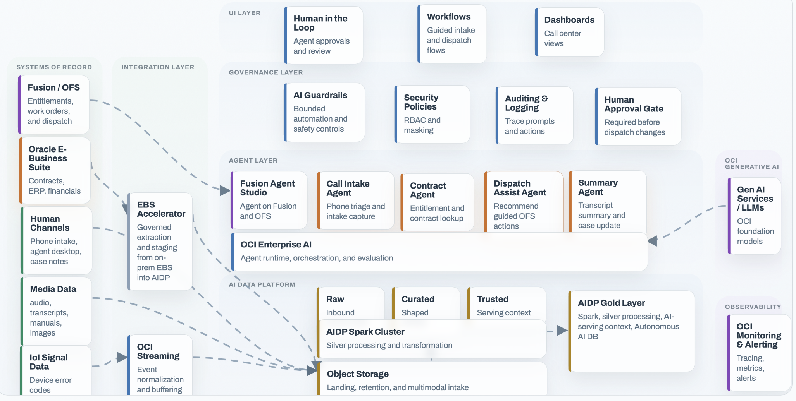

# Select MCP Servers and a Recipe

## Introduction

Project Inception uses MCP servers as explicit, authenticated tool boundaries. Recipes combine those tools with agents, memory, APIs, and interfaces. In this lab, you will choose the smallest tool surface for your scenario and use Smart Dispatch as the reference workflow.

Estimated Time: 30 minutes

### Objectives

In this lab, you will:

* Understand the standard MCP server structure and authentication modes.
* Select the MCP server and permitted tools for your use case.
* Trace the Smart Dispatch reference workflow.
* Identify the validation outcomes a delivery team should demonstrate.

## Task 1: Define the MCP boundary

1. Use the Fabric's standard separation of responsibilities:

    | Module responsibility | Purpose |
    |---|---|
    | Server bootstrap | Load approved configuration, configure authentication, and start the transport |
    | Tool registry | Define the complete set of callable tools |
    | Tool implementation | Validate inputs and perform the permitted Oracle or OCI operation |

2. Treat the registry as a security control. A function that is present in the package but absent from the explicit registry must not be callable by an agent.

3. Choose the authentication mode required by each client:

    | Client | Mode | Typical use |
    |---|---|---|
    | Browser-assisted developer or administrator | Interactive OIDC | Authorized inspection and guided testing |
    | Agent backend or command-line workflow | Bearer token/JWT | Per-request authenticated tool calls |

4. Validate the bearer token on every request. Do not rely on a long-lived authenticated MCP session after a token expires.

## Task 2: Select the server and tools

1. Select only the MCP boundary required by the recipe.

    | MCP server | Primary purpose | Example approved operations |
    |---|---|---|
    | SQLcl MCP | Oracle Database query and schema inspection through SQLcl | Execute approved SQL, inspect schema, test connection, identify caller |
    | Object Storage MCP | OCI Object Storage access | Read namespace, list or upload approved objects, identify caller |
    | ADW MCP | Direct Autonomous Database access with propagated identity | Read approved data and, where explicitly designed, perform constrained DML |
    | OCI Database MCP | OCI Database control-plane operations | List approved database resource information and identify caller |

2. Record the exact tool allowlist, input constraints, data classification, required identity, logging fields, timeout, retry behavior, and error response for every selected operation.

3. Keep data-plane and control-plane responsibilities separate. Querying rows in a schema is different from administering or listing OCI database resources.

4. For a proof of value, begin with one read-only MCP server unless the business outcome requires more.

## Task 3: Trace the Smart Dispatch reference recipe

1. Review the Smart Dispatch architecture supplied by Project Inception.

    

2. Trace the reference conversation:

    1. The Call Intake Agent collects and merges the service-request details.
    2. The Memory Agent checks whether prior research is available for the session.
    3. On a cache miss, the Contract Agent uses the SQLcl MCP boundary to retrieve governed service and entitlement information.
    4. The workflow saves the research result and asks whether the user wants to schedule a dispatch.
    5. A later affirmative response crosses a human-in-the-loop gate before the Dispatch Agent invokes the approved action.
    6. A decline routes to a farewell and session-summary path.

3. Map the recipe's runtime responsibilities:

    | Layer | Smart Dispatch reference responsibility |
    |---|---|
    | Interface | React application |
    | Web/API boundary | Node.js gateway plus Python FastAPI agents |
    | Orchestration | LangGraph state workflow |
    | Data tool | SQLcl MCP server |
    | Memory | Oracle-backed conversation checkpoint and shared store |
    | Identity | Browser authorization-code flow and non-interactive token exchange |
    | Observability | Structured logging and trace capture |
    | Consequential action | Explicit dispatch confirmation before execution |

4. Decide which Smart Dispatch concepts transfer to your use case. A future implementation may replace the interface, business agents, database schema, or system-of-record integration while preserving the governed patterns.

## Task 4: Practice component validation

1. Put the selected MCP boundary into the context of a complete reference implementation.

2. Discuss the order a delivery team would validate components. The purpose is to understand the dependency chain, not to deploy software in this workshop.

3. Trace the expected dependency order:

    1. Core runtime libraries import successfully in an isolated environment.
    2. The selected model and database connections pass their component probes.
    3. The MCP server starts with its approved registry and authentication mode.
    4. An authorized identity can list and invoke only the expected tools.
    5. An unauthorized or expired identity receives a controlled denial.
    6. The recipe backend reaches the MCP endpoint and persists the expected state.
    7. The interface completes one golden-path conversation and one declined-action path.

4. Explain why each stage must pass before the next begins. For example, a recipe cannot safely use a tool if the MCP server has not proved its registry and authentication behavior.

## Task 5: Define recipe acceptance criteria

1. Use the following outcomes to evaluate the reference workflow:

    * Intake gathers required fields across multiple turns without losing prior values.
    * A cache hit avoids unnecessary tool calls.
    * A cache miss invokes only the approved SQLcl MCP tools.
    * The database applies the intended identity and data policy.
    * The workflow does not dispatch without explicit confirmation.
    * A declined dispatch produces no system-of-record update.
    * Logs and traces correlate the user session, agent path, tool call, and decision without exposing secrets.
    * Restart or resume behavior matches the approved memory design.

2. Add edge, adversarial, and regression cases for missing information, ambiguous approval, prompt injection, expired identity, tool timeout, and unavailable downstream systems.

## Acknowledgements

* **Authors** - [Anup Ojah](https://github.com/aojah1) and [Luke Farley](https://github.com/lmfarley10), Oracle
* **Contributors**
    * [adrianjalba](https://github.com/adrianjalba)
    * [Andre Correa](https://github.com/andrecorreaneto)
    * [Anup Ojah](https://github.com/aojah1)
    * [Chandrak1907](https://github.com/Chandrak1907)
    * [dawsonmaverick](https://github.com/dawsonmaverick)
    * [Gilson Melo](https://github.com/gilsonmelo)
    * [Greg Keys](https://github.com/gregkeysquest)
    * [JB Anderson](https://github.com/JBAnderson5)
    * [Johannes Murmann](https://github.com/jomurmann)
    * [Kiran Thakkar](https://github.com/kiranthakkar)
    * [mantis](https://github.com/mantis-place)
    * [Noah Paul](https://github.com/npaul64)
    * [Oscar T.](https://github.com/OT16)
    * [praveenkothari](https://github.com/praveenkothari)
    * [rajesharora99](https://github.com/rajesharora99)
    * [Richard Piantini Cid](https://github.com/richardpiantini)
    * [Sania Bolla](https://github.com/sania-bolla)
* **Last Updated By/Date** - Project Inception Team, August 2026
