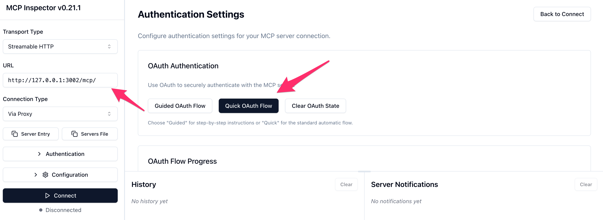

# Apply Governance and Security

## Introduction

Enterprise agents require controls across identity, tools, data, model behavior, human decisions, and operations. This lab turns the Fabric's security and governance capabilities into a use-case-specific control plan.

Estimated Time: 25 minutes

### Objectives

In this lab, you will:

* Design end-to-end identity propagation and secret handling.
* Define tool, data, guardrail, and human-approval controls.
* Plan logging, trace, and continuous-evaluation evidence.
* Create negative tests for the highest-risk failure paths.

## Task 1: Design the identity flow

1. Identify the calling identity at every boundary: browser, application gateway, agent backend, MCP server, OCI service, and Oracle Database.

2. Select the appropriate customer-approved flow:

    | Flow | Use | Required review |
    |---|---|---|
    | Authorization code/OIDC | Interactive web users | Redirect URIs, session storage, cookie controls, scopes, logout, and CSRF protection |
    | OCI API-key token exchange | Non-interactive clients and controlled command-line use | Key custody, user ownership, scope, rotation, caching, and revocation |
    | Workload identity and service token | Background services | Dynamic group or workload identity, least privilege, token lifetime, and audit ownership |
    | End-user database token propagation | User-scoped database access | Trust configuration, database roles, wallet process, VPD, and failure behavior |

3. Use the supplied implementation's MCP OAuth support for an approved interactive validation path.

    

4. Discuss what should happen to a user's access token after sign-in. A secure design keeps it out of browser-visible URLs and logs, limits its lifetime, and validates it at each protected boundary.

## Task 2: Define defense in depth

1. Complete the control matrix.

    | Boundary | Required control | Validation evidence |
    |---|---|---|
    | User to application | SSO, approved scopes, secure session, role check | Successful login plus rejected unauthorized role |
    | Application to agent | Authenticated request, input validation, correlation ID | Traceable request and rejected malformed input |
    | Agent to MCP | Per-request bearer validation and explicit registry | Allowed tool list plus rejected expired token |
    | MCP to OCI or database | Scoped identity, private network path, least privilege | Caller identity and denied out-of-scope operation |
    | Database | Role or VPD policy, bind variables, audit trail | Two identities receive appropriately different results |
    | Agent action | Deterministic validation and human approval where consequential | Approval and decline audit records |
    | Secrets | OCI Vault or approved secret manager | Workload can read only the required secret versions |

2. Keep agents away from direct system-of-record access when an integration boundary is required. Use an approved MCP or Oracle Integration workflow that exposes only the necessary business operation.

3. Define fail-closed behavior. When identity, policy, guardrail, or downstream validation is unavailable, the agent must not improvise a privileged result.

## Task 3: Configure governance expectations

1. Define input and output guardrail policies for harmful content, prohibited topics, sensitive information, and organization-specific restrictions.

2. Define observability events for:

    * Session and trace identifiers.
    * Agent and workflow node transitions.
    * Tool name, duration, result classification, and error category.
    * Human approval request, decision, actor, and timestamp.
    * Model name, token usage, latency, and policy outcome.
    * Database caller identity and policy outcome where approved.

3. Do not log raw access tokens, secrets, wallets, private prompts containing restricted data, or unrestricted tool results.

4. Establish trace and log retention according to the customer data classification and incident-response policy.

## Task 4: Design continuous evaluation

1. Organize evaluation cases into four categories:

    | Category | Purpose |
    |---|---|
    | Golden | Expected business paths and correct outcomes |
    | Edge | Missing, ambiguous, large, delayed, or unusual inputs |
    | Adversarial | Prompt injection, privilege escalation, data exfiltration, and unsafe action requests |
    | Regression | Permanent reproduction of previously discovered defects |

2. Use deterministic assertions before model judging:

    * Assertion checks confirm the final state.
    * Trajectory checks confirm required tools, routes, and approvals.
    * Groundedness checks confirm factual claims came from permitted evidence.
    * Rubric checks assess tone, clarity, policy citation, and other qualitative outcomes.

3. Set separate pass thresholds by category. A high average score must not hide a failed adversarial or authorization test.

4. Treat model-judge results as probabilistic evidence. Re-run isolated qualitative failures and preserve deterministic checks for security and business invariants.

## Task 5: Run the security review checklist

1. Require negative-test evidence for:

    * Missing, malformed, expired, and wrong-audience tokens.
    * A valid identity without the required application or database role.
    * A tool name that is implemented but not registered.
    * SQL or tool input outside the approved operation.
    * Cross-session and cross-user memory access.
    * Prompt injection embedded in user text, documents, and database fields.
    * Ambiguous, withdrawn, duplicate, and expired human approvals.
    * Downstream timeout, partial failure, and retry behavior.
    * Secret or token redaction in application logs and traces.

2. Record the control owner, result, evidence location, remediation owner, and retest date for every failed check.

3. Obtain customer security approval before introducing production data or enabling a system-of-record write path.

## Acknowledgements

* **Authors** - [Anup Ojah](https://github.com/aojah1) and [Luke Farley](https://github.com/lmfarley10), Oracle
* **Contributors**
    * [adrianjalba](https://github.com/adrianjalba)
    * [Andre Correa](https://github.com/andrecorreaneto)
    * [Anup Ojah](https://github.com/aojah1)
    * [Chandrak1907](https://github.com/Chandrak1907)
    * [dawsonmaverick](https://github.com/dawsonmaverick)
    * [Gilson Melo](https://github.com/gilsonmelo)
    * [Greg Keys](https://github.com/gregkeysquest)
    * [JB Anderson](https://github.com/JBAnderson5)
    * [Johannes Murmann](https://github.com/jomurmann)
    * [Kiran Thakkar](https://github.com/kiranthakkar)
    * [mantis](https://github.com/mantis-place)
    * [Noah Paul](https://github.com/npaul64)
    * [Oscar T.](https://github.com/OT16)
    * [praveenkothari](https://github.com/praveenkothari)
    * [rajesharora99](https://github.com/rajesharora99)
    * [Richard Piantini Cid](https://github.com/richardpiantini)
    * [Sania Bolla](https://github.com/sania-bolla)
* **Last Updated By/Date** - Project Inception Team, August 2026
